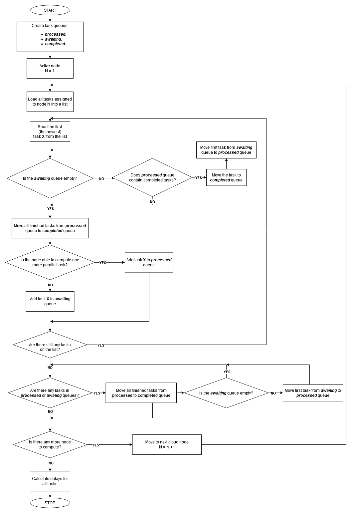

# lb-simulator

## Table of contents

- [lb-simulator](#lb-simulator)
  * [Table of contents](#table-of-contents)
  * [Generator](#generator)
      - [Run](#run)
      - [Tasks distribution](#tasks-distribution)
  * [Shard allocator](#shard-allocator)
  * [Simulator](#simulator)
  * [Example of generated data](#example-of-generated-data)
    + [Requests](#requests)
    + [Load vectors](#load-vectors)
    + [Shard allocated](#shard-allocated)
    + [Simulator](#simulator)

 
## Generator

Generator takes following parameters:
- `num_of_shards`, which defines number of vectors that will be generated - it's identical to number of shards located in total on cloud.
- `num_of_samples`, which defines nomber of periods that will be considered when generating tasks.
- `new_period`, which defines the amount of time related to one element of load vector. Default value is `5.0`
- `shape`, which defines &alpha; parameter of gamma distribution from which number of tasks per period will be drawn.
- `size`, which defines &beta; parameter of gamma distribution from which number of tasks per period will be drawn.
 
#### Run

Generate requests and load vectors using following function from `generator` module:
```python
def generator(num_of_shards, num_of_samples, new_period, shape, scale)
```

#### Tasks distribution

Tasks are drawn from gamma distribution, but to be precise - as far as `shape` parameter is scalar -  it's Erlang distribution, whose mean and standard deviation can be calulated with following equations:

 &mu; = &alpha; * &beta; </br>
 &sigma; =  &beta; * √&alpha;


## Shard allocator

Shard allocator is able to allocate shards on nodes according to one of three algorithms:
- `random` - evenly distribute shards on nodes with random order
- `sequential` - evenly distribute shards on nodes with sequential order
- `SALP` - Shards Allocation based on Load Prediction

```python
def shard_allocator(shards, nodes, algorithm_name):
```

- `shards` - number of shards
- `nodes` - number of nodes
- `algorithm_name` - one of listed above algorithm `random`/`sequential`/`SALP`


## Simulator

```python
def simulator(parallel_requests, new_period):
```

Simulator takes two parameters:
- `parallel_requests` - number of requests that could be processed on node at once,
- `new_period`, which defines the amount of time related to one element of load vector. Default value is `5.0`.


Simulator algorithm:




## Example of generated data


```python
generator(5, 10, 5, 2, 2)
```

### Requests

<details>
 <summary>
Example of requests
 </summary>
|  id  |timestamp|shard|load  |
|------|---------|-----|------|
|0     |1.56     |1    |12.221|
|1     |2.895    |1    |8.789 |
|2     |3.765    |3    |4.164 |
|3     |10.0     |3    |2.007 |
|4     |10.22    |5    |3.824 |
|5     |10.45    |1    |4.14  |
|6     |10.605   |2    |7.647 |
|7     |12.44    |1    |3.452 |
|8     |14.29    |5    |3.069 |
|9     |16.88    |3    |3.781 |
|10    |19.63    |5    |5.0   |
|11    |20.91    |2    |8.126 |
|12    |23.275   |4    |3.159 |
|13    |23.665   |5    |3.319 |
|14    |25.32    |4    |6.323 |
|15    |25.91    |4    |0.938 |
|16    |25.95    |1    |12.248|
|17    |26.415   |1    |4.473 |
|18    |26.57    |5    |0.577 |
|19    |27.775   |2    |5.004 |
|20    |28.315   |5    |5.905 |
|21    |30.065   |4    |4.648 |
|22    |30.555   |2    |5.702 |
|23    |31.135   |5    |15.114|
|24    |31.195   |4    |3.907 |
|25    |31.505   |3    |0.329 |
|26    |31.62    |3    |3.506 |
|27    |34.13    |4    |4.986 |
|28    |36.065   |2    |9.23  |
|29    |37.085   |1    |0.613 |
|30    |39.42    |2    |2.097 |
|31    |41.39    |5    |0.963 |
|32    |41.42    |4    |4.456 |
|33    |44.585   |4    |1.779 |
|34    |46.305   |5    |2.526 |
|35    |47.535   |2    |2.493 |
|36    |49.105   |5    |2.03  |


</details>

### Load vectors

<details>
 <summary>
Example of load vectors
 </summary>

| [1] | [2] | [3] | [4] | [5] | [6] | [7] | [8] | [9] | [10] | [11] |
|-----|-----|-----|-----|-----|-----|-----|-----|-----|-----|-----|
|3.109|0.0  |4.921|0.178 |0.0   |2.527 |0.178 |2.211|0.0  |0.0  |0.0  |
|0.0  |0.0  |0.879|0.65  |0.818 |1.252 |1.445 |2.154|0.303|1.982|0.006|
|0.247|0.586|0.401|0.624 |0.132 |0.0   |0.742 |0.025|0.0  |0.0  |0.0  |
|0.0  |0.0  |0.0  |0.0   |0.345 |1.411 |2.194 |0.843|0.799|0.448|0.0  |
|0.0  |0.0  |0.907|0.546 |1.193 |0.849 |2.617 |1.0  |0.193|3.152|0.227|


</details>


### Shard allocated

```python
shard_allocator(shards, nodes, algorithm_name):
```

<details>
 <summary>
Example of shards allocated with random algorithm
 </summary>

|shard|node |
|-----|-----|
|1    |2    |
|2    |2    |
|3    |1    |
|4    |1    |
|5    |2    |

</details>


### Simulator

<details>
 <summary>
Example of output from simulation
 </summary>

|id   |timestamp|shard|load  |expected_end_time|actual_end_time|delay |
|-----|---------|-----|------|-----------------|---------------|------|
|0    |1.56     |1    |12.221|13.781           |13.781         |0.0   |
|1    |2.895    |1    |8.789 |11.684           |11.684         |0.0   |
|2    |3.765    |3    |4.164 |7.929            |7.929          |0.0   |
|3    |10.0     |3    |2.007 |12.007           |12.007         |0.0   |
|4    |10.22    |5    |3.824 |14.044           |14.044         |0.0   |
|6    |10.605   |2    |7.647 |18.252           |18.252         |0.0   |
|5    |11.684   |1    |4.14  |14.59            |15.824         |1.234 |
|7    |12.44    |1    |3.452 |15.892           |15.892         |0.0   |
|8    |14.29    |5    |3.069 |17.359           |17.359         |0.0   |
|9    |16.88    |3    |3.781 |20.661           |20.661         |0.0   |
|10   |19.63    |5    |5.0   |24.63            |24.63          |0.0   |
|11   |20.91    |2    |8.126 |29.036           |29.036         |0.0   |
|12   |23.275   |4    |3.159 |26.434           |26.434         |0.0   |
|13   |23.665   |5    |3.319 |26.984           |26.984         |0.0   |
|14   |25.32    |4    |6.323 |31.643           |31.643         |0.0   |
|15   |25.91    |4    |0.938 |26.848           |26.848         |0.0   |
|17   |26.434   |1    |4.473 |30.888           |30.907         |0.019 |
|18   |26.57    |5    |0.577 |27.147           |27.147         |0.0   |
|16   |26.848   |1    |12.248|38.198           |39.096         |0.898 |
|19   |27.775   |2    |5.004 |32.779           |32.779         |0.0   |
|20   |28.315   |5    |5.905 |34.22            |34.22          |0.0   |
|22   |30.555   |2    |5.702 |36.257           |36.257         |0.0   |
|21   |30.907   |4    |4.648 |34.713           |35.555         |0.842 |
|25   |31.643   |3    |0.329 |31.834           |31.972         |0.138 |
|24   |31.972   |4    |3.907 |35.102           |35.879         |0.777 |
|23   |32.779   |5    |15.114|46.249           |47.893         |1.644 |
|26   |35.555   |3    |3.506 |35.126           |39.061         |3.935 |
|27   |35.879   |4    |4.986 |39.116           |40.865         |1.749 |
|28   |36.065   |2    |9.23  |45.295           |45.295         |0.0   |
|29   |39.061   |1    |0.613 |37.698           |39.674         |1.976 |
|30   |39.42    |2    |2.097 |41.517           |41.517         |0.0   |
|32   |41.42    |4    |4.456 |45.876           |45.876         |0.0   |
|31   |41.517   |5    |0.963 |42.353           |42.48          |0.127 |
|33   |44.585   |4    |1.779 |46.364           |46.364         |0.0   |
|34   |46.305   |5    |2.526 |48.831           |48.831         |0.0   |
|35   |47.535   |2    |2.493 |50.028           |50.028         |0.0   |
|36   |49.105   |5    |2.03  |51.135           |51.135         |0.0   |

</details>
